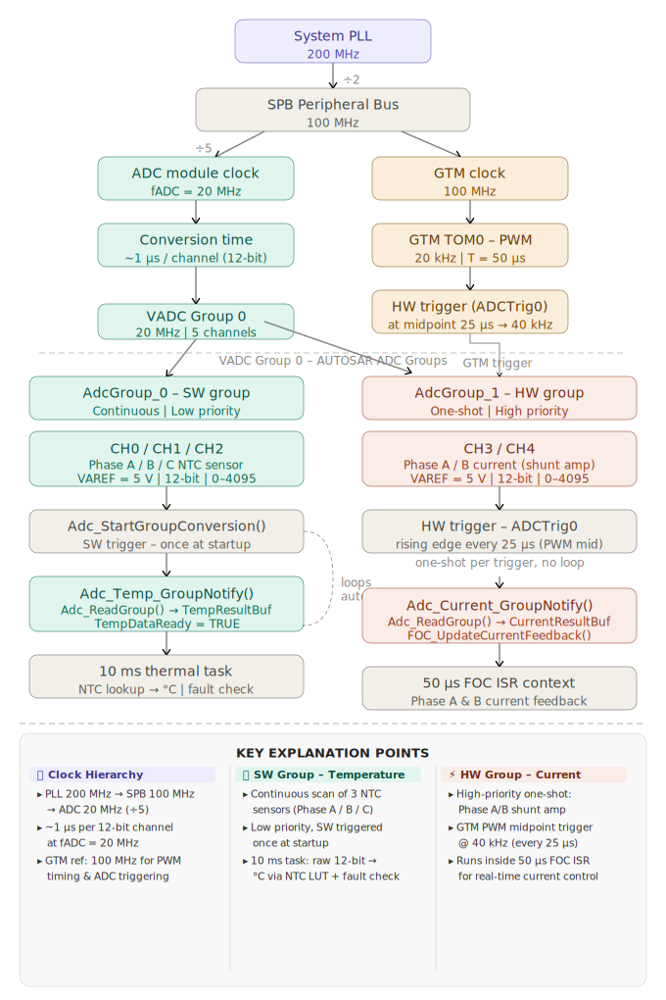
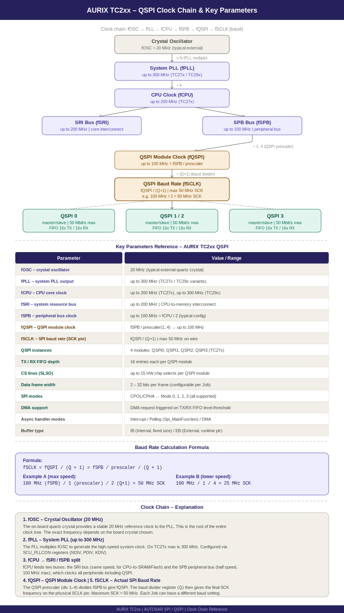
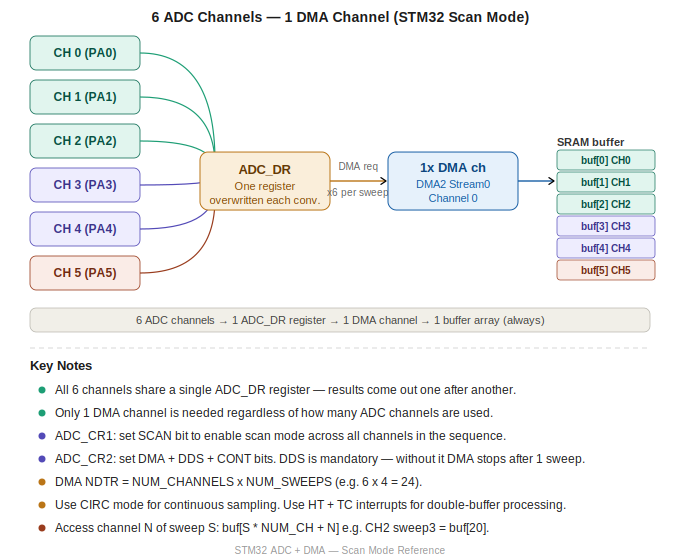

Author : Sudhir Acharya
### what are interview Interview Structure?
- Basic C Questions
- Programming
  - Bit Manipulation
  - DSA / Array
- Project Explanation
- Problems You Have Faced

### What is my Professional Summary",
Senior Embedded Software Engineer with 11+ years of experience in automotive embedded systems, specializing in
device driver development, AUTOSAR MCAL, and low-level firmware engineering.`


### What are my Technical Skills",
Device Drivers: ADC, SPI, I2C, UART, PORT, GPIO, DMA & AUTOSAR MCAL
AUTOSAR Stack: MCAL, RTE, BSW configuration using EB Tresos; Vector DaVinci
Microcontrollers / SoCs: Infineon AURIX TriCore TC2xx, NXP MCU, ARM Cortex architecture
Protocols / Interfaces: SPI, I2C, UART, CAN
RTOS: OSEK-based RTOS, task/ISR scheduling, interrupt handling
Debugging & Test Tools: TRACE32 (JTAG), Oscilloscope, Logic Analyzer, USB Analyzer, CANoe, HIL setups
Programming Languages: Embedded C, Python, MATLAB, MISRA-C guidelines
Build & DevOps: Linux, Docker, cross-compilation, CI/CD pipelines, GitHub, Makefile, ARM GCC toolchain
Requirements & SCM: IBM DOORS (traceability), MKS/PTC Integrity, SW-E5 process compliance`


### What is my Experience",
Continental Automotive, Bangalore
Software Engineer | May 2019 – Present
• Responsible for MCAL development and software integration and testing
• Performed software integration and validation of AUTOSAR MCAL drivers ADC, SPI
• Performed Linux Docker migration

Tech Mahindra, Bangalore
Software Engineer | Dec 2017 – Apr 2019
• Developed and configured AUTOSAR MCAL IO drivers for ADC, SPI, and Timer modules in EB Tresos
• Performed board bring-up on Infineon AURIX TC2xx including JTAG debug via TRACE32, flash programming, and ADC/SPI peripheral validation on target hardware

KPIT Technologies Limited, Bangalore
Software Engineer | Feb 2017 – Aug 2017
• Designed and developed reusable AUTOSAR-compliant software libraries for MFX and IFX modules
• Conducted unit testing to validate functionality and integration alignment

BISS-ITW, Bangalore
Firmware Developer | Sep 2013 – Jan 2017
• Developed and optimized software on Texas Instruments DSP processors for real-time signal processing applications
• Developed drivers for ADC and DAC modules to support sensor data acquisition and signal conversion`


### What are my Projects",
ADC and Timer/Watchdog Driver Development | Infineon AURIX TC2xx, EB Tresos, TRACE32
• Developed and validated low-level MCAL device drivers for Infineon AURIX TC2xx (TriCore) microcontroller, covering ADC, SPI, PORT, DMA, Timer, and Watchdog peripherals
• Performed register-level peripheral configuration, interrupt handling, and DMA channel setup
• Configured Timer channels for periodic triggering
• Configured Watchdog timer to monitor MCU health and trigger system reset on failure
• Performed board bring-up activities including JTAG debug via TRACE32, flash programming, and peripheral validation on TC2xx target hardware
• Validated driver functionality using TRACE32 (JTAG) debugger, Logic Analyzer, and Oscilloscope

SPI Driver Development
• Developed and integrated SPI driver for external memory (read/write operations) on Infineon AURIX TC2xx, covering register-level configuration, chip select handling, and data transfer sequences
• Validated SPI communication and memory read/write functionality using TRACE32 (JTAG) debugger, Logic Analyzer, and Oscilloscope

Software Integration
• End-to-end software integration, release preparation, and validation aligned with DOORS-defined requirements
• Ensured compliance with SW-E5 process through build delivery, traceability, and milestone-based quality checkpoints

AUTOSAR Library Development
• Developed modular software libraries conforming to AUTOSAR v4.2.2 specifications (MFX, IFX, IFL, MFL, EFX, E2E)
• Applied MISRA C guidelines to ensure code safety, reliability, and compliance
• Performed rigorous unit testing to validate functionality


### ADC Project


## QSPI Project


## DMA Example using 6 channel ADC



### what is prmitive data types
    Type       Size      Range (signed)
    -------    ------    ----------------------------
    char       1 byte    -128 to 127
    int        4 bytes   -2,147,483,648 to 2,147,483,647
    float      4 bytes   ~6-7 decimal digits
    double     8 bytes   ~15-16 decimal digits

### what are the Storage classes:
    Keyword     Lifetime     Scope          Stored In
    ---------   ----------   ------------   -----------
    1.auto        Block        Local          Stack
    2.static      Program      Local/File     .data / .bss
    3.extern      Program      Global         .data
    4.register    Block        Local          CPU Register (hint only)

### what is qualifiers ?
    qualifiers are keywords that modify the behavior of variables and data types
    volatile
    const

### what are the type modifier in c
    short, long, signed, unsigned

### Derived dataypes
    Structure
    Union

### wha are the Userdefined data types 
    Enum
    Typedef

## what is typecasting and type conversion
    implicit->autoatically done by compiler for two compatiable data types
    explicit ->done by programmer using typecast operator to make sure no valuble data los
    type promotion-> smaller data to large one

### what is Identifier: 
identifier is simply the name used to identify variables, functions, arrays, structures, 
or any other user-defined element in a program. It’s how you give a meaningful label to entities in your code.
    int a;
    void add()

### Volatile Keyword in C
    Volatile is a qualifier that is applied to a variable when it is declared.
    It tells the compiler that the value of the variable may change at any time-without any action being taken by the code the compiler finds nearby.

    volatile uint32_t *TIMER_REG = (uint32_t *)0x40000000;

    while (*TIMER_REG == 0) {
        // Without volatile: compiler reads once, caches value
        //                   --> loop never exits (wrong!)
        // With volatile:    reads from HW register every iteration (correct)
    }

## what is the use of const keyword in c
    The const (constant) qualifier is a type qualifier in C and C++ programming languages 
    used to declare that a variable's value is fixed, read-only, 
    and cannot be modified after initialization. 
    It acts as a compiler-enforced constraint to prevent accidental modifications,
     enhancing code security and allowing optimization. 

### What is const volatile — does it make sense?

    const volatile uint32_t *STATUS_REG = (uint32_t *)0x40000010;

    YES — makes perfect sense for read-only hardware status registers:
    const    --> value cannot change, compiler enforces read-only
    volatile --> value can change outside compiler's knowledge,
                 prevents compiler optimization
    
    example:
    const volatile int  var
    
## What is  directrives in C
    pre-prcoessor directive: #include, #ifdef
    assembler Directive: .data , .bss, .section
    Compiler directive: #pragma pack

## what is Pre-prcoessor direcive
    #include <stdio.h>       // include system header
    #define PI 3.14          // object-like macro

    ### Pre processor directives
    #include <stdio.h>       // include system header

    #define PI 3.14          // object-like macro
    #undef PI                // undefine macro

    #ifdef DEBUG             // if macro defined
    #endif

    #undefine PI 3.24
    #ifndef HEADER_H         // if macro NOT defined (include guard)
    #define HEADER_H
    #endif

    #pragma pack(1)          // struct alignment

    #error "message"         // force compile error
    #warning "message"       // compile warning (GCC extension)

## what is assembler directive
 commands in assembly language source code that instruct the assembler software how to process the program,
 rather than being translated into machine code instructions
 in Linker we have .bss, .data, .txt this are assebler directiver

### what is compiler Directive
    Instructions to the compiler during compilation. Tells it how to compile, optimize, or handle specific code.

    #pragma is a compiler-specific directive.
    It gives special instructions to the compiler that are not part of standard C syntax.

    #pragma pack(n)Set structure member alignment to n bytes

###  Error in embedded C

| Error Type        | When Detected      | Tool                  | Output                       |
|-------------------|--------------------|-----------------------|------------------------------|
| Compiler Error    | Compile time       | GCC / armcc           | No .o file generated         |
| Linker Error      | Link time          | LD / armlink          | No .elf / .hex generated     |
| Runtime Error     | Execution on target| Debugger / TRACE32    | HardFault / wrong behavior   |
| Warning           | Compile time       | GCC                   | Binary generated (risky)     |
| Logical Error     | Testing/Validation | Logic analyser / CANoe| Wrong output                 |
| Preprocessor Error| Pre-compile        | CPP                   | No .o file generated         |

### what is inline fucntion
“Inline” Function is a provision or feature provided by the compiler. Inline is a request made to the compiler to replace the inline function call with the function definition.


inline void fun(/*fun argument */)
{
    /* Function source Code */
}
When a normal function call happens function creates its stack in the main stack and initializes all local variables. After completion of function call return value is given back if any and stack is destroyed. Much time is consumed in stack operation. Hence for small functions, Inline function is beneficial as the call is replaced by definition, so no external stack is created and operations are much faster for small, commonly-used functions.


### Inline Function vs Macro

    Feature           Macro (#define)                     Inline Function
    -----------       ------------------------------      ------------------------------
    Expansion         Preprocessor (text substitution)    Compiler (code inlining hint)
    Type checking     None                                Yes — full C type checking
    Debugging         Hard — no symbol in debugger        Easy — shows in stack trace
    Scope             Global (no scope rules)             Follows C scoping rules
    Side effects      Dangerous — args evaluated twice    Safe — args evaluated once
    Return value      No (expression only)                Yes — has a return type
    Recursion         Not possible                        Possible (compiler may not inline)
    Header needed     No                                  Defined in header (static inline)

### what is side of MACRO instead of using inline function?
    Side effect trap (Macro):

        #define SQ(x)  ((x) * (x))

        int a = 3;
        int r = SQ(a++);   // expands to ((a++) * (a++)) — UB, a incremented twice

    Safe with inline:

        static inline int sq(int x) { return x * x; }

        int a = 3;
        int r = sq(a++);   // a++ evaluated once, safe — r = 9, a = 4

    When to use which:

        Use Macro    ->  Simple constants (#define MAX 100)
                         Conditional compilation (#ifdef DEBUG)
                         Stringification / token pasting (# and ##)

        Use Inline   ->  Any computation involving arguments
                         When type safety matters
                         When you need to step through in debugger

### what is the diffrence between Structure vs Union
    Feature           struct                              union
    -----------       ------------------------------      ------------------------------
    Memory            Sum of all member sizes             Size of largest member only
    Storage           Each member has its own memory      All members share same memory
    Access            All members accessible anytime      Only last-written member valid
    Use case          Group related data fields            Memory-efficient variant types
    Padding           Yes — compiler may add padding      Yes — based on largest member

### what is the diffrence between typedef vs #define

    Feature           typedef                             #define
    -----------       ------------------------------      ------------------------------
    Processed by      Compiler                            Preprocessor (before compile)
    Type checking     Yes — real type alias               No — pure text substitution
    Scope             Follows C scoping rules             Global from point of definition
    Pointer types     Correct and safe                    Dangerous — see trap below
    Debugger          Shows type name                     Expanded text, no type name
    Arrays / complex  Works cleanly                       Breaks easily

       
### what is rentrant fucntion
    If you call a function once, pause the execution while it's in the middle of running,
    then call it a second time, the function is now running in two "contexts."
    The point is that the function can be running multiple times simultaneously, which usually means in multiple threads.

    Example:
    int add(int a, int b) {
        int c = a + b;   // c is on the stack, local to this call
        return c;
    }

    what is the use?
      That’s why you can call add(2,3) and add(5,7) at the same time FROM DIFFRENT THREAD— each call has its own c.

### Polymorphism in C++
     Polymorphism means **one interface, multiple behaviors**.
    Two types: Compile time and Runtime.

   
### Whats  Function Overloading — Compile Time Polymorphism
        Same function name, different parameter types or count.
        Compiler decides which function to call at **compile time**.

        int add(int a, int b)         { return a + b; }
        float add(float a, float b)   { return a + b; }

### Whatis  Function Overriding — Runtime Polymorphism

        Child class redefines a parent class function.
        Decision is made at **runtime** using virtual table (vtable).

### Trap C questions
    --
    unsigned char x= 0xff;

    if(~x)
        printf("hello");
    else
        printf("world")
    
    Result: it will print hello,
    x is promoted to integer from char in bit mainpualtion before ~
    --

    (*fnptr)++; //this will incremnet  the value

#### what is  array vs pointer

    int main() {
        int a[] = {1, 2, 3};
        int *p = a;
        printf("%d", *(p + 2));
        return 0;
    }

    result : 03

### ASCII & Characters

    '0' = 0x30 = 48
    'A' = 0x41 = 65
    'a' = 0x61 = 97
    Difference between upper and lower case = 32

    Lowercase to Uppercase:   str[i] = str[i] - 32
    Uppercase to Lowercase:   str[i] = str[i] + 32


### What are th Pointers declartion and meaning?

int array[6] = {4, 3, 5, 6, 3, 8};

+-----------------------+----------------------------------------------------------------------+
| Declaration           | Meaning and Example                                                  |
+-----------------------+----------------------------------------------------------------------+
| int *ptr              | pointer to int                                                       |
|                       | int *ptr = &array[0];                                                |
+-----------------------+----------------------------------------------------------------------+
| int **ptr             | pointer to pointer to int                                            |
|                       | int *p = &array[0];  int **ptr = &p;                                 |
+-----------------------+----------------------------------------------------------------------+
| int (*ptr)[6]         | pointer to entire array of 6 ints                                    |
|                       | int (*ptr)[6] = &array;                                              |
+-----------------------+----------------------------------------------------------------------+
| void (*ptr)(void)     | pointer to function, no args, void return                            |
|                       | void foo(void);  void (*ptr)(void) = foo;                            |
+-----------------------+----------------------------------------------------------------------+
| int (*ptr)(int, int)  | pointer to function, 2 int args, int return                          |
|                       | int add(int,int);  int (*ptr)(int,int) = add;                        |
+-----------------------+----------------------------------------------------------------------+
| int *ptr[6]           | array of 6 pointers to int                                           |
|                       | int *ptr[6] = {&array[0], &array[1], &array[2],                      |
|                       |                &array[3], &array[4], &array[5]};                     |
+-----------------------+----------------------------------------------------------------------+


### what is the Difference between *ptr++, (*ptr)++, and *++ptr?

    int arr[] = {10, 20, 30};
    int *ptr = arr;

    *ptr++    --> returns 10, then moves ptr to arr[1]
    (*ptr)++  --> increments VALUE at ptr, arr[0] becomes 11, ptr unchanged
    *++ptr    --> moves ptr to arr[1] first, then returns 20

    *Note: 
    if + is near to p adress will increment  *++p or *p++
    if + is near to * data will increment (*ptr)++, ++*p, 

### Difference between const int *ptr and int * const ptr?

    const int *ptr        --> can change ptr, cannot change *ptr
    int * const ptr       --> can change *ptr, cannot change ptr
    const int * const ptr --> cannot change either

### What is a function pointer? Embedded use case?

    int add(int a, int b)
    {
        return a + b;
    }

    int main(void)
    {
        int (*fnptr)(int, int);   // declare function pointer
        fnptr = add;              // point it at add()

        int result = fnptr(3, 4); // call through pointer
        printf("Result = %d\n", result);  // prints 7
        return 0;
    }

    Used for: interrupt vector tables, state machines, callbacks.

### what are the Pointer Types?
    1.Null pointer
    2.wild pointer
    3.dangling pointer
    4.double pointer
    5.void pointer

## what is null nul, wild, dangling pointer

    NULL Pointer:A pointer that is explicitly assigned NULL.It does not point to any valid memory address.
    int *p = NULL;
    Dereferencing a NULL pointer causes segmentation fault.

    Wild Pointer:A pointer that is declared but NOT initialized.
    It points to some random/garbage address — behavior is undefined.
    int *p;       // wild pointer — NOT initialized
    *p = 10;      // dangerous! writing to unknown address
    Fix: always initialize to NULL if address is not known yet.

    Dangling Pointer:
    A pointer that points to memory that has already been freed.
    After free(), the pointer still holds the old address — using it is undefined behavior.
    int *p = malloc(sizeof(int));
    free(p);      // memory released
    *p = 10;      // DANGLING — undefined behavior
    Fix: after free(), always set p = NULL.

### what double, void pointer
    Double Pointer (Pointer to Pointer):
    A pointer that stores the address of another pointer.
    int a = 10;
    int *p = &a;
    int **pp = &p;   // pp → p → a
    Used in: dynamic 2D arrays, modifying pointer inside a function.

    Void Pointer (Generic Pointer):
    A pointer with no associated data type.
    Can be type-casted to any pointer type.
    void *p;
    int a = 10;
    p = &a;                    // valid — no cast needed
    printf("%d", *(int*)p);    // type cast required to dereference
    Used in: malloc(), memcpy(), generic functions like qsort().

### Array Pointer vs Function Pointer

    | Aspect      | Array Pointer          | Function Pointer         |
    |-------------|------------------------|--------------------------|
    | Points to   | Data (RAM)             | Code (Flash / .text seg) |
    | Memory seg  | Stack / Heap / BSS     | .text segment            |
    | Operation   | Read / write the value | Call / execute only      |
    | Arithmetic  | Valid                  | Not meaningful           |

### what is the diffrence *a[10] vs (*a)[10]
    *a[10]   -> [] first, array of pointers
    (*a)[10] -> *  first, pointer to an array

    /* array of pointers */
    int x = 1, y = 2, z = 3;
    int *a[3] = {&x, &y, &z};
    printf("%d\n", *a[1]);       /* 2 */

    /* pointer to array */
    int arr[10] = {0};
    int (*p)[10] = &arr;
    printf("%d\n", (*p)[3]);     /* 0 */

### how to type caste pointer adress
    (void *) ptr
    (char *)ptr

### Explain memory layout in C

    High Address
    +---------------------+
    |        Stack        |   Local vars, function frames      (grows ↓)
    +---------------------+
    |    (free space)     |
    +---------------------+
    |        Heap         |   malloc / calloc                  (grows ↑)
    +---------------------+
    |        .BSS         |   Uninitialized globals/statics    (zeroed at startup, RAM)
    +---------------------+
    |        .Data        |   Initialized globals/statics      (FLASH → RAM copy at boot)
    +---------------------+
    |       .rodata       |   const globals, string literals   (FLASH, read-only)
    +---------------------+
    |        .text        |   Machine instructions only        (FLASH, read-only, execute)
    +---------------------+
    Low Address

### Explain startup code task?
    in startup  .ro data copied to .data section

    FLASH                              RAM
                                          
    +----------------+                +----------------+
    |   .text        |  (runs here    |                |
    |   .rodata      |   directly,    |                |
    |                |   no copy)     |                |
    +----------------+                +----------------+
    |   .data image  | ─── copy ───►  |   .data        |
    |   speed=100    |   at startup   |   speed=100    |
    +----------------+                +----------------+
                                      |   .bss         |
                            zero ──►  |  (zeroed)      |
                            fill      +----------------+
                                      |   Heap / Stack |
                                     +----------------+

#### what are the Compilation Stages
    .c --> [Preprocessor] --> .i --> [Compiler] --> .s --> [Assembler] --> .o --> [Linker] --> .elf/.bin/.hex

    Stage          Input    Output   Job
    -----------    -----    ------   -------------------------------------------
    Preprocessor   .c       .i       Expand macros, ###include, ###ifdef, remove comments
    Compiler       .i       .s       Generate assembly (syntax + semantic check)
    Assembler      .s       .o       Generate machine code object file
    Linker         .o       .elf     Resolve symbols, link libs, apply memory map

### Difference between .bin, .hex, and .elf?

    Format   Description                          Used For
    ------   ----------------------------------   --------------------
    .bin     Raw binary bytes                     Direct flash write
    .hex     Intel HEX (ASCII + address + CRC)    Most programmers
    .elf     With debug symbols                   GDB debugging
    .mot     Motorola S-Record                    Automotive tools

### Bootup sequence
    Power ON / Reset
        │
        ▼
    Reset Vector ──► points to startup code (written in assembly)
        │
        ▼
    Startup Code
    ├── Set up Stack Pointer
    ├── Copy .data section: FLASH → RAM
    └── Zero out .bss section
        │
        ▼
    SystemInit()  ──► Configure system clocks & hardware
        │
        ▼
    main()  ──► Application entry point
                ⚠️  Must NEVER return in embedded systems!

### What is a Reset Vector?

    Fixed memory address the CPU fetches and jumps to after reset.
    On ARM Cortex-M:
        0x00000000 = initial Stack Pointer value
        0x00000004 = Reset Handler address (start of startup code)

### Embedded System Startup Flow or reset to main or power on

- **Reset Vector**: CPU fetches the reset vector, which points to the startup code (written in assembly).
- **Startup Code**:
  - Sets up the **stack pointer**.
  - Copies initialized variables from **FLASH to RAM** (`.data` section).
  - Zeros out uninitialized variables (`.bss` section).
- **SystemInit()**: Configures system clocks and hardware setup.
- **main()**: Application entry point.  
  - In embedded systems, `main()` should **never return**.

### Dynamic Memory Allocation

    malloc(size)        allocate, memory is UNINITIALIZED (garbage)
    calloc(n, size)     allocate n items, memory is ZERO-INITIALIZED
    realloc(ptr, size)  resize existing allocation (may move memory)
    free(ptr)           release -- always set ptr = NULL after!

### how to create our own malloc, my malloc?
    simply create statci int char[500] --> this will exceeds data segment and cross heap section
    we cant use pointer like assigning heap adress to ptr, next moment if we use malloca this adress wil be occupied

### What is a memory leak? How to detect?

    void leak(void) {
        int *ptr = malloc(100);
        return;   // forgot free() --> heap shrinks on every call
    }             //                --> eventually malloc returns NULL --> crash

    Fix: always pair malloc with free:
        int *ptr = malloc(100);
        if (ptr == NULL) return;
        // ... use ptr ...
        free(ptr);
        ptr = NULL;

### Why is malloc avoided in safety-critical embedded?

    - Non-deterministic timing (MISRA C rule violation)
    - Heap fragmentation over time
    - Memory leaks cause silent failure
    - Limited RAM on MCU gets exhausted unpredictably

    Alternative -- static memory pool:

        uint8_t pool[NUM_BUFS][BUF_SIZE];
        uint8_t inUse[NUM_BUFS] = {0};


### What is interrupt latency?
    Time from interrupt signal assertion to first ISR instruction executing.
    Factors: CPU pipeline flush, saving context (stacking registers), priority.
    ARM Cortex-M3: typically 12 clock cycles minimum latency.

### What is a race condition between ISR and main? How to fix?
    Problem:
        volatile uint32_t counter = 0;
        void TIMER_ISR(void) 
        { 
            counter++; 
        }

        int main(void) {
            uint32_t val = counter;   // ISR may fire between read and write!
        }

    counter++ is a 3-step operation: read, modify, write.
    ISR can interrupt between any step --> corrupted value.

    Fix: disable interrupts around the critical section:
        __disable_irq();
        uint32_t val = counter;
        __enable_irq();


### What is interrupt priority and nesting?

    Higher priority interrupts can preempt lower priority ISRs.
    ARM Cortex-M: lower number = higher priority (0 = highest).
    Configured via NVIC (Nested Vectored Interrupt Controller).

        NVIC_SetPriority(UART1_IRQn, 1);   // high priority
        NVIC_SetPriority(TIM2_IRQn,  5);   // lower priority

## Whats is NVIC Table

    | Letter | Full Word  | What It Does                                           |
    |--------|------------|--------------------------------------------------------|
    | N      | Nested     | Higher priority IRQ can interrupt a lower priority ISR |
    | V      | Vectored   | Each interrupt has a fixed address in the vector table |
    | I      | Interrupt  | Handles hardware interrupt signals from peripherals    |
    | C      | Controller | Hardware block that manages priorities, enabling, pending |

### Dynamic memory allocation

    // 1. malloc — allocates raw uninitialized memory
    int *ptr = malloc(sizeof(int));          // contents are garbage

    // 2. calloc — allocates AND zero-initializes
    int *ptr = calloc(100, sizeof(int));     // 100 ints, all set to 0

    // 3. realloc — resize an existing allocation
    ptr = realloc(ptr, 200 * sizeof(int));   // grow/shrink, may move ptr

    // 4. free — release back to heap
    free(ptr);                               // how does it know the size? ↓

    Note:When you call malloc(100), the allocator doesn't just give you 100 bytes. 
        It secretly allocates a metadata block just before your pointer:


##  Watchdog Timer

    Hardware timer that resets the MCU if not kicked within a timeout.
    Detects software hangs and crashes.
    Essential for unattended and safety-critical systems.

## RTOS Concepts

    RTOS = Real-Time Operating System
    Schedules multiple tasks with deterministic timing.
    Guarantees response within a deadline.

## stack, que, ring buffer

| Property      | Stack                          | Queue                          | Ring Buffer                        |
|---------------|--------------------------------|--------------------------------|------------------------------------|
| Concept       | Abstract data structure        | Abstract data structure        | Concrete implementation            |
| Order         | LIFO - Last In First Out       | FIFO - First In First Out      | FIFO - First In First Out          |
| Insert        | Push - adds to TOP             | Enqueue - adds to REAR         | Write at head pointer              |
| Remove        | Pop - removes from TOP         | Dequeue - removes from FRONT   | Read at tail pointer               |
| Access        | Top only                       | Front only                     | Head and tail pointers             |
| Size          | Dynamic or fixed               | Dynamic or fixed               | Always fixed                       |
| When full     | Stack overflow                 | Queue full error               | Overwrites old data                |
| Memory        | Array or linked list           | Array or linked list           | Fixed array only                   |
| Wrap around   | No                             | No                             | Yes - index % SIZE                 |
| Time O(n)     | Push O(1) / Pop O(1)           | Enqueue O(1) / Dequeue O(1)    | Read O(1) / Write O(1)             |
| Use case      | Function calls, undo, recursion| Task scheduling, BFS           | UART, audio, DMA, sensor logging   |
| Embedded use  | Call stack, ISR nesting        | Message queues in RTOS         | UART, SPI, CAN buffers in drivers  |
| RTOS example  | FreeRTOS task stack            | FreeRTOS xQueue                | DMA circular mode, UART ring buf   |
| Your code     | Implicit call stack in main()  | Concept used in USART IRQ      | rx_buff[] in USART2_IRQHandler     |

### Sempahore
in rtos, a semaphore is a syxbronization mechanism used to manage access to shared resource and cororinates task. 
semaphore helps prevent issues like race condtion and deadlock in multi tasking 
enviranioment by ensuring that only a specified number of task can access a resource at time.

exammple:
 Parking Lot with N slots Multiple people can enter (up to N slots).  ANY person can signal (release a slot). When slots = 0, everyone WAITS.

### Mutexes:
    in rtos and multithreadifn environment, a mutex is asyncornization mecanism that prevent multiple task or thread from acess that same shared reosurce at asame trime/
    how mutex works:
    a mutex act like lock.a task must aquire the lock the mutex before access the shared resoucre.
    once the a task finsihed using the resoucrece, it release(unlcok) the mutx allowing other task to acess it.
    if another task tries to aquire the mutex while its locked, it has to wait untill the mutex is relases
Example:
Toilet with 1 key 🚽, Only 1 person can enter at a time. The SAME person who locked must unlock.

### Difference between mutex and semaphore?

    Feature              Mutex                         Semaphore
    ----------------     --------------------------    ----------------------
    Ownership            Owned by locking task         No ownership
    Priority inversion   Protected                     Not protected
    Use case             Mutual exclusion (shared data) Signaling

    xSemaphoreTake(mutex, portMAX_DELAY);
    sharedBuffer[0] = 42;   // critical section
    xSemaphoreGive(mutex);

### Difference between a Process and a thread?

    Process (one program running)
    │
    ├── Shared: heap, globals, code, file descriptors
    │
    ├── Thread 1 → own stack, PC, registers
    ├── Thread 2 → own stack, PC, registers
    └── Thread 3 → own stack, PC, registers

### What is priority inversion? How is it solved?

    Scenario:
    - Low-priority task holds mutex
    - High-priority task needs that mutex -- blocks
    - Medium-priority task runs instead (doesn't need mutex)
    - High-priority task effectively runs at low priority

    Solution: Priority Inheritance
    - Temporarily boost low-priority task to match high-priority waiter
    - FreeRTOS mutexes support this automatically


###  What is a deadlock? How to avoid it?

    Task A holds Mutex1, waits for Mutex2.
    Task B holds Mutex2, waits for Mutex1.
    Both block forever --> deadlock.

    Prevention:
    - Always acquire mutexes in the SAME ORDER across all tasks
    - Use timeouts instead of blocking forever
    - Minimize number of mutexes held at the same time

### Difference between UART, SPI, CAN, I2C?
    Feature          UART               SPI                      I2C                      CAN
    -----------      ----------------   ----------------------   ----------------------   ----------------------
    Wires            2 (TX, RX)         4 (MOSI,MISO,SCK,CS)     2 (SDA, SCL)             2 (CANH, CANL)
    Speed            up to ~5 Mbps      up to 100mhz            100k / 400k / 1MHz/3mhz       125k / 250k / 500k / 1Mbps
    Topology         Point-to-point     1 master, multi slave    Multi master+slave        Multi master (bus)
    Addressing       None               Chip Select per slave    7-bit address             11-bit / 29-bit ID
    Synchronous      No (async)         Yes                      Yes                      No (async)
    Error handling   None               None                     ACK only                 CRC, ACK, error frames
    Use case         Debug, GPS, BT     Flash, ADC, display      Sensors, EEPROM           Automotive ECUs, OBD


### What is I2C clock stretching?
    Slave holds SCL line LOW to pause the master while preparing data.
    Master must wait until slave releases SCL.
    Some I2C masters do not support clock stretching -- check datasheet!

## Communication Protocol

### i2c Communication

    +-------+----------+---+----------+---+--------+---+---+
    |   S   | ADDR[7:1]|R/W|  A/NA    |  DATA[7:0] | A |P  |
    +-------+----------+---+----------+---+--------+---+---+

    Field       Bits    Driven by       Description
    -------     ----    ----------      ---------------------------
    S             -     Master          START condition
    ADDR        [7:1]   Master          7-bit slave address
    R/W          [0]    Master          0 = Write, 1 = Read
    A/NA          -     Slave           ACK after address
    DATA        [7:0]   Master(W)/      8 data bits, MSB first
                        Slave(R)
    A/NA          -     Slave(W)/       ACK after data byte
                        Master(R)
    P             -     Master          STOP condition


#### what is i2c clock Speed

    Mode            Speed       Notes
    -----------     --------    ---------------------------
    Standard        100 kHz     All devices supported
    Fast            400 kHz     MPU-6050, SSD1306 supported
    Fast mode+      1 MHz       SSD1306 (some variants)
    High speed      3.4 MHz     Rare, special hw needed

    Pull-up resistors:
    100 kHz  ->  4.7 kohm typical
    400 kHz  ->  2.2 kohm typical
    1 MHz    ->  1.0 kohm typical

### what is Dominat and reccesive

Differential signaling on CAN_H and CAN_L lines:

State       CAN_H       CAN_L       Differential (H-L)
---------   -------     -------     ------------------
Dominant    3.5 V       1.5 V       +2.0 V  (logic 0)
Recessive   2.5 V       2.5 V        0.0 V  (logic 1)

Dominant wins on bus (wired-AND): any node sending 0 pulls bus dominant.


### Expalin CAN frame
---
Type                Description
----------------    ----------------------------------------
Data Frame          Carries actual data (most common)
Remote Frame        Requests data from another node (RTR=1)
Error Frame         Signals a detected error on the bus
Overload Frame      Requests delay between frames
------

+-----+-------------+-----+-----+-----+-----+----------+-----------+-----+-----+
| SOF |   ID[10:0]  | RTR | IDE | r0  | DLC |   DATA   |  CRC+DEL  | ACK | EOF |
+-----+-------------+-----+-----+-----+-----+----------+-----------+-----+-----+
  1 b      11 b       1 b   1 b   1 b   4 b   0-64 b      15+1 b    1+1b   7 b

* Data: 0 to 8 bytes (0 to 64 bits)

Field       Bits    Value           Description
-------     ----    -----           ----------------------------------
SOF           1     0 (dom)         Start of frame, sync all nodes
ID         [10:0]   0x000-0x7FF     Message priority + identifier
RTR           1     0=Data, 1=Rmt  Remote Transmission Request
IDE           1     0               0 = Standard frame (11-bit ID)
r0            1     0 (dom)         Reserved, always dominant
DLC         [3:0]   0-8             Number of data bytes
DATA        0-64b   payload         Actual data, MSB first
CRC          15b    calculated      CRC over SOF+ID+ctrl+data
CRC DEL       1     1 (rec)         CRC delimiter, always recessive
ACK slot      1     0 (dom)         Receiver pulls dominant = ACK
ACK DEL       1     1 (rec)         ACK delimiter
EOF           7     1111111 (rec)   End of frame
IFS           3     111 (rec)       Intermission (bus idle)

---
### UART Communication

One UART frame = 1 start bit + data bits + optional parity + stop bit(s)

IDLE  Start   D0   D1   D2   D3   D4   D5   D6   D7   Parity  Stop  IDLE
----+       +----+----+----+----+----+----+----+----+--------+------+----
    |       |                                                 |      |
    +-------+                                                 +------+
      LOW                   data bits (LSB first)              HIGH

+------+------+----+----+----+----+----+----+----+----+--------+------+
| IDLE | STRT | D0 | D1 | D2 | D3 | D4 | D5 | D6 | D7 |  PAR  | STOP |
+------+------+----+----+----+----+----+----+----+----+--------+------+
         1 b   <-------- 5 to 9 data bits -------->   0 or 1b  1-2 b

Field       Bits    Value       Description
-------     ----    -----       ----------------------------------
IDLE          -     1 (HIGH)    Line idle state
Start         1     0 (LOW)     Signals start of frame
Data        5-9     payload     LSB sent first (D0 first)
Parity      0-1     E/O/N       Even, Odd, or None
Stop        1-2     1 (HIGH)    End of frame, line returns HIGH

---


### what are the ADC Formulas?

    Resolution = Vref / 2^n

    Example — 12-bit ADC:

    Resolution = 5V / 4096 = 1.22 mV

    Vout = (ADC_value / (2^n - 1)) x Vref
    ```

    - `ADC_value` — raw ADC output (0 to 4095 for 12-bit)
    - `2^n - 1` — max count = 4095
    - `Vref` — reference voltage = 5V

    Examples:

    | ADC Value | Calculation         | Result      |
    |-----------|---------------------|-------------|
    | 4095      | 4095 x 5 / 4095     | 5.00 V (max)|
    | 2048      | 2048 x 5 / 4095     | ~2.50 V     |
    | 0         | 0 x 5 / 4095        | 0.00 V (min)|


### ADC groups w.r.t AUTOSAR

    ADC Groups
    AUTOSAR organizes ADC channels into Groups
    
    Group is a collection of one or more channels that are converted together.
    Each group has a trigger source (SW or HW)
    Each group has a conversion mode (one-shot or continuous)
    Each group has a result buffer (linear or circular)

    2. Conversion Modes
    Mode          Description
    One-shot       Single conversion per trigger, then stops
    Continuous     Keeps converting in a loop until explicitly stopped
    Scan           Converts all channels in the group sequentially

    3. Trigger Sources
    Trigger Source        Macro / Config Value      Description
    Software trigger      ADC_TRIGG_SRC_SW          Trigger via Adc_StartGroupConversion()
    Hardware trigger       ADC_TRIGG_SRC_HW         Timer, PWM event, or external pin

    4. Notification (Callback)
    Each group can have a notification function (callback) registered in configuration.
    It is called at end-of-conversion (similar to an ISR-driven callback).
    /* Example notification function prototype */
    void AdcGroup0_ConversionComplete(void);

### ADC API Reference

SW TRIGGERED FLOW
    Adc_Init(&AdcConfig)
        |
        v
Adc_SetupResultBuffer(Group0, resultBuffer)
// Tells the ADC driver where to store conversion results.
// Links Group0 to your result array in RAM.
        |
        v
Adc_EnableGroupNotification(Group0)
// Registers a callback to fire when Group0 conversion completes.
// Enables interrupt-based notification instead of polling.
        |
        v
Adc_StartGroupConversion(Group0)
// Triggers the ADC hardware to begin sampling all channels in Group0.
// Software initiates the conversion (SW-triggered mode).
        |
        v
    [HW converts all channels in Group0]
// ADC hardware samples each channel sequentially/simultaneously.
// Stores raw digital results into the linked resultBuffer.
        |
        v
    [Notification callback fires]
// ISR or callback function is invoked automatically by the driver.
// Signals application that all Group0 results are ready to read.
        |
        v
Adc_ReadGroup(Group0, resultBuffer)
// Copies converted ADC values from driver buffer into application buffer.
// Returns status; resultBuffer now holds valid channel readings.
        |
        v
    Use result in application logic
// Process ADC values: scaling, threshold check, control decisions, etc.
// e.g., temperature = (resultBuffer[0] * VREF) / ADC_RESOLUTION


## AUTOSAR SPI Key Concepts

    Master                          Slave
    ------                          -----
    SCLK  -----------------------------> SCLK
    MOSI  -----------------------------> MOSI
    MISO  <----------------------------- MISO
    CS    -----------------------------> CS
    GND   ------------------------------ GND

    CS pulled LOW by master to select slave.

- **Channel** — Basic data unit. Holds a buffer of data elements to be transferred.
- **Job** — A sequence of one or more Channels sharing the same CS (Chip Select).
- **Sequence** — A group of one or more Jobs. Unit of transmission triggered by SW.
- **EB Buffer** — External Buffer; pointer to user-provided RAM buffer (dynamic).
- **IB Buffer** — Internal Buffer; statically allocated inside the SPI driver.
- **Hw Unit** — Physical SPI peripheral (e.g., QSPI0, QSPI2 on AURIX TriCore).


### List SPI MODES 

SPI Modes (CPOL + CPHA)
```
| Mode | CPOL | CPHA | Clock Idle | Sample On    |
|------|------|------|------------|--------------|
|  0   |  0   |  0   |    LOW     | Rising edge  |
|  1   |  0   |  1   |    LOW     | Falling edge |
|  2   |  1   |  0   |    HIGH    | Falling edge |
|  3   |  1   |  1   |    HIGH    | Rising edge  |
```

## What is SPI Synchronous vs Asynchronous or trnasimission mode?
    SPI bus is always clocked, hardware sync is not negotiable
    Sync vs Async is a software architecture choice, not a hardware one
    DMA frees CPU but driver design decides if SW is truly async
    Best architecture is async driver as base with sync wrapper on top
    In RTOS, task pends on semaphore, ISR gives on transfer complete
    Prefer sync for boot sequences, short commands, and simple debug scenarios
    Prefer async with DMA for flash bulk ops, frame buffers, and RTOS multitasking


## list SPI API
SPI SW TRIGGERED FLOW
    Spi_Init(&SpiConfig)
        |
        v
Spi_SetupEB(Channel0, srcBuffer, destBuffer, length)
// Tells the SPI driver source (TX) and destination (RX) buffers.
// Links Channel0 to your data arrays in RAM with transfer length.
        |
        v
Spi_EnableJobNotification(Job0)
// Registers a callback to fire when Job0 transmission completes.
// Enables interrupt-based notification instead of polling.
        |
        v
Spi_AsyncTransmit(Sequence0)
// Triggers the SPI hardware to begin transmitting Sequence0.
// Software initiates the transfer (SW-triggered async mode).
        |
        v
    [HW transmits all channels in Sequence0]
// SPI hardware shifts out TX bytes and simultaneously captures RX bytes.
// Handles chip select (CS) assertion/de-assertion automatically per job.
        |
        v
    [Job/Sequence notification callback fires]
// ISR or callback function is invoked automatically by the driver.
// Signals application that all Sequence0 bytes are sent and received.
        |
        v
Spi_ReadIB(Channel0, destBuffer)
// Copies received SPI bytes from driver internal buffer to app buffer.
// Returns status; destBuffer now holds valid RX data from slave device.
        |
        v
    Use result in application logic
// Process RX data: parse sensor response, decode register values, etc.
// e.g., sensorVal = (destBuffer[0] << 8) | destBuffer[1]

## what is SPI Synchronous vs Asynchronous ?

| #  | Point                                                                              |
|----|------------------------------------------------------------------------------------|
| 1  | SPI bus is always clocked, hardware sync is not negotiable                         |
| 2  | Sync vs Async is a software architecture choice, not a hardware one                |
| 3  | DMA frees CPU but driver design decides if SW is truly async                       |
| 4  | Best architecture is async driver as base with sync wrapper on top                 |
| 5  | In RTOS, task pends on semaphore, ISR gives on transfer complete                   |
| 6  | Prefer sync for boot sequences, short commands, and simple debug scenarios         |
| 7  | Prefer async with DMA for flash bulk ops, frame buffers, and RTOS multitasking     |

### UART REGISTERS
```markdown
## STM32 Register Reference Table

### RCC — Reset & Clock Control

| Register        | Bit Used   | What it does                                      |
|-----------------|------------|---------------------------------------------------|
| RCC->AHBENR     | Bit 17     | Enable GPIOA clock (STM32F072)                    |
| RCC->AHBENR     | Bit 18     | Enable GPIOB clock (STM32F072)                    |
| RCC->AHBENR     | Bit 19     | Enable GPIOC clock (STM32F072)                    |
| RCC->IOPENR     | Bit 0      | Enable GPIOA clock (STM32G0xx)                    |
| RCC->IOPENR     | Bit 1      | Enable GPIOB clock (STM32G0xx)                    |
| RCC->IOPENR     | Bit 2      | Enable GPIOC clock (STM32G0xx)                    |
| RCC->APBENR1    | Bit 17     | Enable USART2 peripheral clock                    |

---

### GPIO — General Purpose I/O (GPIOA)

| Register        | Bit Used   | What it does                                      |
|-----------------|------------|---------------------------------------------------|
| GPIOA->MODER    | Pin x 2    | Set pin mode: 00=Input 01=Output 10=AltFunc 11=Analog |
| GPIOA->AFR[0]   | Bit 8      | Set AF1 (USART2 TX) on PA2                        |
| GPIOA->AFR[0]   | Bit 12     | Set AF1 (USART2 RX) on PA3                        |
| GPIOA->BSRR     | Bit 5      | Set PA5 HIGH — LED ON                             |
| GPIOA->BSRR     | Bit 21     | Reset PA5 LOW — LED OFF                           |
| GPIOA->ODR      | Bit 5      | Toggle PA5 using XOR (commented out)              |

---

### USART2 — Universal Async Receiver Transmitter

| Register        | Bit Used   | What it does                                      |
|-----------------|------------|---------------------------------------------------|
| USART2->BRR     | 0x682      | Set baud rate to 9600 @ 16MHz                     |
| USART2->CR1     | Bit 0      | UE — Enable USART2 peripheral                     |
| USART2->CR1     | Bit 2      | RE — Enable Receiver                              |
| USART2->CR1     | Bit 3      | TE — Enable Transmitter                           |
| USART2->CR1     | Bit 5      | RXNEIE — Enable RX not empty interrupt            |
| USART2->ISR     | Bit 5      | RXNE flag — 1 = new data received                 |
| USART2->ISR     | Bit 7      | TXE flag — 1 = TX register empty, ready to send  |
| USART2->RDR     | —          | Read received byte from here                      |
| USART2->TDR     | —          | Write byte here to transmit                       |

---

### NVIC — Nested Vector Interrupt Controller

| Register        | Bit Used   | What it does                                      |
|-----------------|------------|---------------------------------------------------|
| NVIC->ISER[0]   | Bit 28     | Enable USART2 interrupt in CPU                    |
```


## what is inheritance
Inheritance   = child gets parent's properties and methods

## MCU
Diffrenc between timer and counter
Timer   = counts internal clock pulses  (measures TIME)
Counter = counts external event pulses  (measures EVENTS)

## what is my Linux OS Road map

| Phase   | File             | Concepts                                  |
|---------|------------------|-------------------------------------------|
| Phase 1 | `lo_mutex.c`     | Mutex, threads, race conditions           |
| Phase 1 | `lo_semaphore.c` | Semaphore, shared memory, fork            |
| Phase 1 | `lo_process.c`   | fork, wait, waitpid, execvp, exit         |
| Phase 1 | `lo_threads.c`   | pthread_create, join, exit, return values |
| Phase 1 | `lo_sharedmem.c` | mmap, sem_init, shared structures         |
| Phase 2 | `lo_pipe.c`      | Pipes with fork                           |
| Phase 2 | `lo_fifo.c`      | Named pipes (FIFO)                        |
| Phase 2 | `lo_msqueue.c`   | Message queues                            |
| Phase 2 | `lo_socket.c`    | Sockets (do this last)                    |
| Phase 3 | `lo_malloc.c`    | malloc/free internals                     |
| Phase 3 | `lo_stack_heap.c`| Stack vs Heap                             |
| Phase 3 | `lo_mmap.c`      | Memory-mapped files                       |
| Phase 4 | `lo_fileio.c`    | File I/O (open, read, write, close)       |
| Phase 4 | `lo_dirops.c`    | Directory operations                      |
| Phase 4 | `lo_filestat.c`  | File metadata (stat)                      |
| Phase 5 | `lo_signals.c`   | Signal basics                             |
| Phase 5 | `lo_sigaction.c` | sigaction, custom handlers                |
| Phase 6 | `lo_prodcons.c`  | Producer–Consumer problem                 |
| Phase 6 | `lo_readwrite.c` | Readers–Writers problem                   |
| Phase 6 | `lo_deadlock.c`  | Deadlock detection                        |
| Phase 6 | `lo_dining.c`    | Dining Philosophers problem               |


